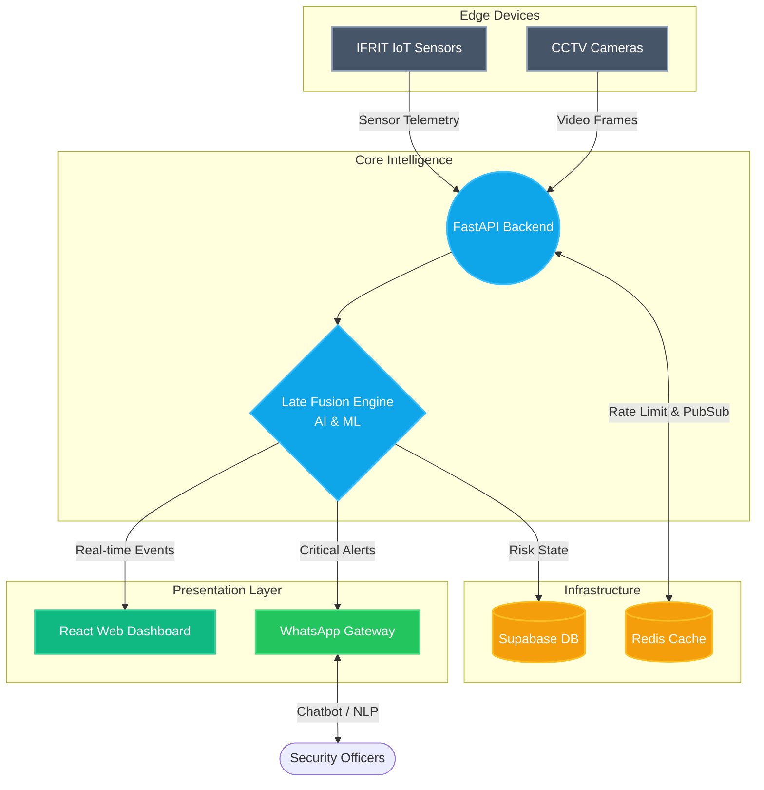

# 🔥 Ifrit — Fire Detection & Monitoring System

> **Ifrit** — An advanced AI-powered fire detection platform that combines Computer Vision with IoT Sensor Fusion for highly accurate, early-warning alerts.

## 🏗 System Architecture



This repository is a **monorepo** containing all the microservices, frontend applications, and hardware firmware required to run the Ifrit platform.

---

## 📚 Documentation Hub

To make navigation easier, the documentation has been split into dedicated guides for each component of the system. 

### 🌟 1. General Guides
Start here to understand the big picture and how to get everything running.
- [System Overview](docs/Overview.md) — High-level architecture and data flow.
- [Getting Started / Run Guide](docs/Getting_Started.md) — How to spin up the entire system via Docker or locally.

### 🧠 2. Backend & AI Core (`/backend`)
The intelligence hub powered by Python, FastAPI, and Supabase.
- [API Reference](backend/docs/API_Reference.md) — Complete REST and WebSocket endpoints.
- [System Logic & Late Fusion](backend/docs/System_Logic.md) — How YOLOv8 and Isolation Forest ML combine to prevent false positives.

### 💻 3. Web Dashboard (`/web`)
The real-time monitoring interface for security personnel.
- [Dashboard Architecture](web/docs/Dashboard_Architecture.md) — Details on the React 19, Vite, and WebSocket implementation.

### 📱 4. WhatsApp Gateway (`/whatsapp-gateway`)
The automated alert dispatcher and NLP chatbot.
- [Gateway Service Guide](whatsapp-gateway/docs/Gateway_Service.md) — How the Node.js + Baileys WhatsApp bot works.

### 🔌 5. IoT Sensors (`/IFRIT`)
The edge hardware measuring smoke, gas, and temperature.
- [Firmware Guide](IFRIT/docs/Firmware_Guide.md) — ESP32 PlatformIO C++ firmware details and sensor calibration.

---

## 🚀 Quick Start (Docker)

The fastest way to get the software stack running is via Docker Compose:

```bash
git clone https://github.com/your-org/ifrit-fire-detection.git
cd ifrit-fire-detection

# Configure your environment variables first!
cp backend/.env.example backend/.env
cp web/.env.example web/.env
cp whatsapp-gateway/.env.example whatsapp-gateway/.env

# Spin up the containers
docker compose up --build -d
```

For manual local development instructions, see the [Getting Started Guide](docs/Getting_Started.md).

---

## 📄 License
Private — All rights reserved.
