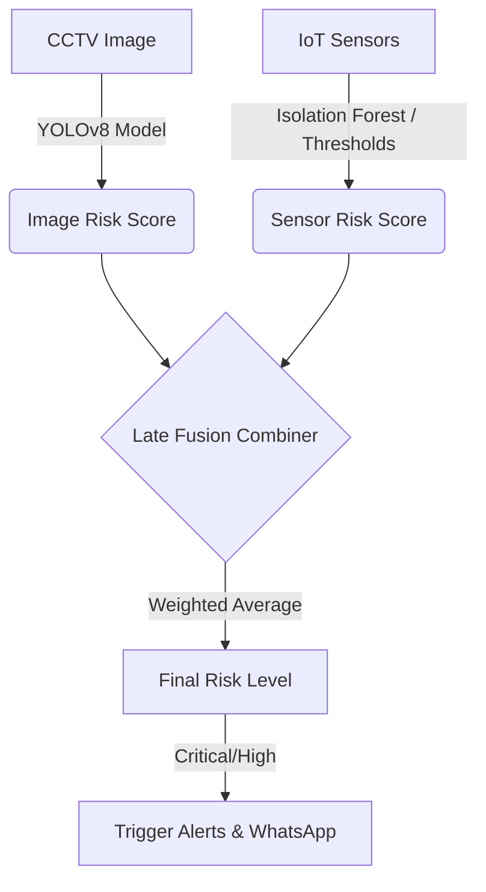

# Backend System Logic & AI Architecture

The Ifrit backend is the intelligence core of the system. It leverages a **Late Fusion Architecture** to combine inputs from Computer Vision (CCTV) and IoT Sensors to accurately determine fire risk.

## 1. Late Fusion Architecture

The core logic resides in `fusion_service.py`. It combines two independent prediction scores to reduce false positives and ensure early detection.

### Flow Diagram

### Fusion Calculation
The final score is a weighted combination of the image score and sensor score. If a camera is offline, the system dynamically shifts to 100% sensor-driven mode, and vice-versa.

## 2. Sensor Anomaly Detection (Dual-Path)

To evaluate sensor data (Smoke, Gas, Temperature, Humidity), the system uses a dual-path strategy:

1. **Isolation Forest (ML Path):** Anomaly detection model trained on historical safe data. It detects unexpected patterns (e.g., rapid temperature rise coupled with dropping humidity).
2. **Rule-Based Thresholds (Fallback Path):** Hardcoded safety thresholds (e.g., MQ2 > 800ppm is critical).
3. **Sanity Gate:** If the ML model hallucinates an anomaly but the raw thresholds are completely safe (e.g., 5 ppm smoke), the system clamps the score to prevent false WhatsApp alerts.

## 3. WhatsApp NLP Chatbot

When a user asks a question via WhatsApp (e.g., "Apakah ada kebakaran?"), the WhatsApp Gateway forwards it to the backend. The backend uses an NLP service to:
- Parse the user's intent.
- Query the Supabase database for the latest sensor readings and room statuses.
- Generate a human-readable response summarizing the situation.

## 4. Device Watchdog

A background async task (`device_watchdog.py`) constantly monitors the "last seen" timestamps of all IoT devices and CCTV cameras. If a device goes offline for a specified period, it updates its status to "offline" and alerts the dashboard.
