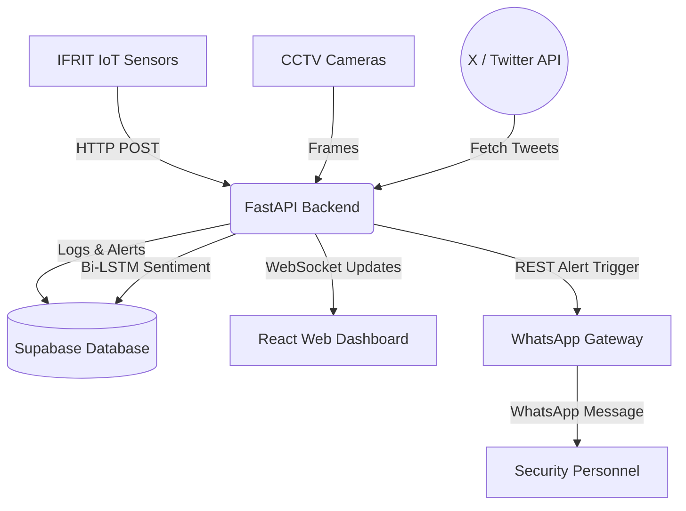

# Ifrit System Overview

Ifrit is an advanced AI-powered fire detection and monitoring platform. It combines IoT sensor data with Computer Vision to provide highly accurate, early-warning fire detection, drastically reducing the chances of false positives through a Late Fusion architecture.

## System Architecture

The project is built on a microservices-inspired architecture, consisting of four primary components:

1. **Backend & AI Core (`/backend`)**
   - Built with Python and FastAPI.
   - Handles the heavy lifting: running YOLO object detection on camera feeds, processing sensor data using Isolation Forest ML models, and serving the REST API and WebSockets.
   - **X (Twitter) Sentiment Analysis**: Runs a Bi-LSTM NLP model to crawl X for keywords (like "kebakaran") and analyze public sentiment/panic as an additional early-warning and social monitoring signal.
   - Connects to Supabase for all database storage and authentication.

2. **Web Dashboard (`/web`)**
   - Built with React 19, Vite, and Tailwind CSS.
   - Provides a real-time command center for security personnel to monitor sensor graphs, view live camera feeds, and manage alerts.

3. **WhatsApp Gateway (`/whatsapp-gateway`)**
   - Built with Node.js and Baileys.
   - Acts as the primary notification dispatcher. It automatically broadcasts critical alerts with images directly to WhatsApp groups or security personnel.

4. **IFRIT IoT Sensors (`/IFRIT`)**
   - The edge hardware devices built on ESP32 microcontrollers.
   - They constantly sample environmental data (smoke, gas, temperature, humidity) and send the telemetry to the backend.

## How Data Flows

## Documentation Map

For detailed guides on each component, refer to the specific documentation folders:

- **[Backend API Reference](../backend/docs/API_Reference.md)**
- **[Backend System Logic](../backend/docs/System_Logic.md)**
- **[Web Dashboard Architecture](../web/docs/Dashboard_Architecture.md)**
- **[WhatsApp Gateway Guide](../whatsapp-gateway/docs/Gateway_Service.md)**
- **[IFRIT Firmware Guide](../IFRIT/docs/Firmware_Guide.md)**
