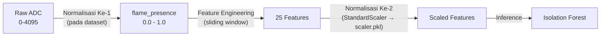

# Rencana Implementasi: Perbaikan Normalisasi Sensor Flame pada Isolation Forest

## Analisis Masalah

Data `flame_presence` pada model Isolation Forest mengalami **dua kali normalisasi** saat proses pelatihan (*training*), namun pada production detector (`detector.py`), normalisasi pertama terlewat sehingga model menerima nilai raw ADC (0-4095) secara langsung.

### Alur Dua Lapisan Normalisasi



**Lapisan 1 — Pra-normalisasi (dilakukan pada dataset awal):**
Dataset training memiliki kolom `flame_presence` dengan nilai yang sudah dinormalisasi ke rentang `[0.0, 1.0]`. Dikarenakan sensor flame menggunakan logika pull-up (nilai ADC rendah = api terdeteksi), normalisasi yang digunakan adalah:
`flame_presence = 1.0 - (raw_adc / 4095.0)`
* Nilai `1.0` artinya api terdeteksi penuh (*flame fully present*).
* Nilai `0.0` artinya aman / tidak ada api.

**Lapisan 2 — StandardScaler (tersimpan di `scaler.pkl`):**
Setelah ekstraksi fitur jendela geser (*sliding window*), seluruh 25 fitur dinormalisasi menggunakan StandardScaler yang dilatih dan disimpan di `scaler.pkl`.

### Bug pada Production Detector

Di [detector.py](file:///home/mawan/Develop/AgniRakhsa-FireDetection/backend/app/ai/iot_sensor/detector.py), method `ingest()` menerima data snapshot dari ESP32 dengan nilai raw FLAME (contoh: `3500.0`). Nilai ini langsung dimasukkan ke sliding window buffer tanpa melalui normalisasi pertama. Hal ini menyebabkan fitur yang diekstrak memiliki rentang ribuan, sedangkan model Isolation Forest dilatih menggunakan rentang `[0.0, 1.0]` untuk fitur flame. Akibatnya, prediksi model menjadi tidak akurat dan memicu salah deteksi (hallucination).

---

## Rencana Perubahan

### 1. Backend / Anomaly Detector

#### [MODIFY] [detector.py](file:///home/mawan/Develop/AgniRakhsa-FireDetection/backend/app/ai/iot_sensor/detector.py)

Menambahkan konstanta dan proses pra-normalisasi untuk sensor flame di method `ingest()` sebelum data dimasukkan ke dalam buffer.

**Modifikasi Konstanta:**
```python
# ─── Flame Sensor Pre-Normalization ──────────────────────────────────────────
# The training dataset had flame_presence values pre-normalized to [0.0, 1.0].
# Raw ADC from ESP32: 0 (fire) → 4095 (no fire, pull-up).
# Training normalization: flame_presence = 1.0 - (raw_adc / 4095)
#   → 1.0 = flame fully present, 0.0 = no flame
FLAME_ADC_MAX = 4095.0
```

**Modifikasi Method `ingest()`:**
```python
    def ingest(self, room_id: str, sensor_snapshot: dict[str, float]) -> None:
        """
        Add a sensor reading snapshot to the room's sliding window buffer.
        """
        # Map ESP32 sensor types → training column names, skipping disabled sensors
        mapped = {}
        for sensor_type, value in sensor_snapshot.items():
            if sensor_type in DISABLED_SENSORS:
                continue
            training_name = SENSOR_TYPE_MAP.get(sensor_type)
            if training_name is not None:
                val = float(value)
                
                # Pre-normalize flame sensor to match training data range [0, 1]
                if training_name == "flame_presence":
                    val = 1.0 - (val / FLAME_ADC_MAX)
                    val = max(0.0, min(1.0, val))  # Clamp safety
                    
                mapped[training_name] = val
```

---

## Rencana Verifikasi

### Pengujian Otomatis (Automated Tests)
1. **Unit Test**: Membuat pengujian yang mengirimkan beberapa nilai raw FLAME (misal: 4095, 2048, 0) ke `ingest()` dan memverifikasi isi buffer untuk memastikan konversi ke rentang `[0, 1]` sudah benar.
2. **Inference Test**: Menguji proses prediksi menggunakan data mock dengan nilai normalisasi baru dan memverifikasi score yang dihasilkan normal.

### Pengujian Manual (Manual Verification)
1. **Inspeksi Scaler**: Memastikan bahwa parameter mean dan std deviasi pada `scaler.pkl` untuk fitur flame (seperti `flame_presence_max`, dll.) bernilai kecil (sesuai skala `[0, 1]`) dan bukan skala ribuan.
2. **Monitoring Log**: Memantau log backend setelah perubahan diterapkan untuk memastikan tidak terjadi anomali deteksi berulang akibat ketidaksesuaian skala sensor flame.
