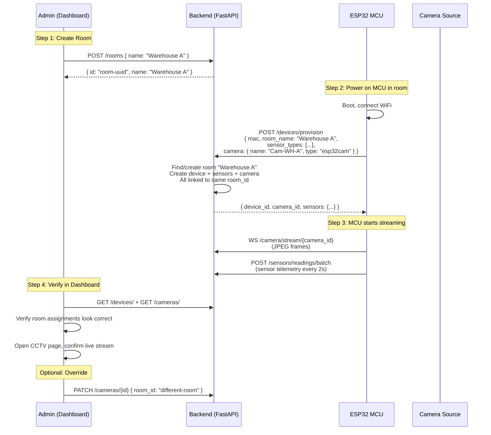

# Camera-to-Room Assignment with Real MCU Hardware — Research Answers

> **Context**: This document answers the 6 research questions from [`camera-mcu-assignment-brief.md`](./camera-mcu-assignment-brief.md), evaluated against the AgniRakhsa system constraints: university capstone, FastAPI + Supabase + React + ESP32, 5–20 rooms, budget-conscious.

---

## Q1: Camera Discovery & Registration Strategies

### Comparison Matrix

| Strategy | Complexity | UX (Field Tech) | Scalability | Security | Stack Fit | Verdict |
|---|---|---|---|---|---|---|
| **A. Manual UI** (current) | ⭐ Very Low | ⭐⭐ Mediocre — error-prone at scale | ⭐⭐ Low | ⭐⭐⭐⭐ Good — admin-gated | ⭐⭐⭐⭐⭐ Perfect | **Good baseline** |
| **B. ONVIF Discovery** | ⭐⭐⭐ High | ⭐⭐⭐⭐ Great — auto-finds IP cams | ⭐⭐⭐⭐ High | ⭐⭐⭐ Moderate — needs credential mgmt | ⭐⭐⭐ Fair — SOAP/XML overhead | Overkill for capstone |
| **C. mDNS/Bonjour** | ⭐⭐ Medium | ⭐⭐⭐ Good — ESP32-CAMs broadcast themselves | ⭐⭐⭐ Medium | ⭐⭐ Low — no built-in auth | ⭐⭐⭐ Fair — needs mDNS on server | Good for ESP32-CAM fleet |
| **D. QR-Code Commissioning** | ⭐⭐⭐ Medium-High | ⭐⭐⭐⭐⭐ Best — scan & done | ⭐⭐⭐⭐ High | ⭐⭐⭐⭐ Good — physical proximity = auth | ⭐⭐ Poor — needs mobile app | Cool but scope creep |
| **E. Firmware-Driven Provision** | ⭐⭐ Low-Medium | ⭐⭐⭐⭐ Great — zero admin steps | ⭐⭐⭐⭐ High | ⭐⭐⭐ Moderate — trusts firmware | ⭐⭐⭐⭐⭐ Perfect — extends existing flow | **🏆 RECOMMENDED** |

### Recommendation: **Firmware-Driven Provisioning (E) + Manual Override (A)**

**Why?** Your MCU firmware already calls `POST /devices/provision` on boot. The simplest, most production-realistic approach is to **extend this endpoint** so the MCU can also register its co-located camera in the same API call. The admin UI remains available as a manual override for IP cameras or cameras not physically attached to an MCU.

**How it works:**
1. MCU boots → calls `/devices/provision` with existing payload + a new optional `camera` field
2. Backend creates both the device record AND the camera record, both linked to the same `room_id`
3. Admin can override room assignments later via the Device Management UI

This approach:
- Requires **zero additional admin steps** for the common case
- Fits perfectly with the existing architecture
- Falls back to manual UI for standalone IP cameras
- Adds only ~20 lines of backend code

---

## Q2: ESP32-CAM Integration

### Can ESP32-CAM stream to our backend via WebSocket?

**Yes, but with significant constraints:**

| Resolution | Typical FPS | JPEG Frame Size | Bandwidth Needed | Practical? |
|---|---|---|---|---|
| QVGA (320×240) | 20–25 FPS | ~5–15 KB | ~100–300 KB/s | ✅ Yes |
| VGA (640×480) | 10–15 FPS | ~15–40 KB | ~150–600 KB/s | ⚠️ Marginal |
| SVGA (800×600) | 5–8 FPS | ~30–60 KB | ~150–480 KB/s | ❌ Not recommended |
| UXGA (1600×1200) | 1–3 FPS | ~80–150 KB | ~80–450 KB/s | ❌ Unusable for real-time |

**Key hardware requirements:**
- **PSRAM is mandatory** — without it, you're limited to QVGA and constant crashes
- **Stable 5V/2A power supply** — the #1 cause of choppy/failing streams
- **External antenna mod** — the PCB antenna is often inadequate for production reliability

### Should ESP32-CAM do on-device inference?

**No. Offload to the backend (current approach).** Here's why:

| Factor | On-Device (TFLite Micro) | Off-Device (Backend YOLO) |
|---|---|---|
| Model quality | Very limited (TinyML, high false-positive rate) | Full YOLOv8 — high accuracy |
| Resolution | Max ~96x96 input after quantization | Full 640×480 input |
| Latency | ~200-500ms per frame on ESP32 | ~50-100ms per frame on PC/GPU |
| Maintenance | Re-flash firmware to update model | Update Python file, restart server |
| Suitability for fire safety | ❌ Too many false negatives | ✅ Production-grade accuracy |

> [!IMPORTANT]
> For a **fire safety system**, false negatives are unacceptable. The ESP32 simply cannot run a model accurate enough for this use case. Always offload inference to a capable backend or edge compute node.

### Unified provisioning for camera + sensors on one board

If using ESP32-CAM (camera + sensors on one board), the `POST /devices/provision` endpoint should auto-create both records:

```json
// Extended provision request
{
  "name": "IFRIT_ESP32_CAM_01",
  "mac_address": "AA:BB:CC:DD:EE:FF",
  "room_name": "Warehouse A",
  "sensor_types": ["MQ2", "MQ4", "SHTC3_TEMP", "FLAME"],
  "camera": {
    "name": "Warehouse A - ESP32CAM",
    "camera_type": "esp32cam",
    "stream_mode": "websocket"
  }
}
```

```json
// Extended provision response
{
  "device_id": "uuid-device",
  "camera_id": "uuid-camera",
  "sensors": { "MQ2": "uuid-1", "MQ4": "uuid-2", ... }
}
```

After provisioning, the ESP32-CAM firmware would:
1. Start sensor telemetry loop (existing code)
2. Start camera frame loop: capture JPEG → base64 → WebSocket send to `/camera/stream/{camera_id}`

---

## Q3: Edge Compute Node Architecture

### Three Architectures Compared

```
Architecture A: Current (Centralized Inference)
  ESP32-CAM → frames via WS → [Backend Server] → YOLO → Fusion → Dashboard
  
Architecture B: Edge Inference (Raspberry Pi / Jetson)
  IP Camera → RTSP → [Edge Pi/Jetson] → YOLO locally → results via HTTP → Backend → Fusion
  
Architecture C: Hybrid
  ESP32-CAM → frames via WS → [Edge Pi] → YOLO → results → Backend → Fusion
  ESP32 MCU → sensor data via HTTP → Backend → Fusion
```

| Factor | A: Centralized | B: Edge (Pi/Jetson) | C: Hybrid |
|---|---|---|---|
| **Bandwidth** | High (raw frames traverse network) | Low (only results sent) | Medium |
| **Latency** | Medium (~100-300ms round-trip) | Low (~50-100ms local) | Low |
| **Server load** | High (all inference on 1 server) | Low (distributed) | Low |
| **Hardware cost/room** | ~$5 (ESP32-CAM only) | ~$50-80 (Pi) or ~$150+ (Jetson) | ~$55-85 |
| **Complexity** | Low (1 codebase) | High (firmware + edge + backend) | Highest |
| **Model updates** | Easy (update backend) | Hard (update every edge node) | Medium |
| **Scale limit** | ~5-10 concurrent HD streams per server | ~50+ rooms per server | ~50+ rooms |

### Recommendation for AgniRakhsa

> [!TIP]
> **Start with Architecture A (current centralized approach).** At 5–20 rooms, the server can handle the load. Migrate to Architecture B only if you hit performance bottlenecks or need to scale beyond ~10 concurrent HD streams.

For a capstone demo with ≤20 rooms, **Architecture A is the right choice**:
- Simplest deployment (one server handles everything)
- Easiest to debug and demo
- No need to manage edge node fleets
- YOLOv8 on a modern laptop handles 10-20 streams at VGA easily

If you later commercialize, Architecture B with Raspberry Pi 5 + Hailo-8L AI accelerator (~$80 total) gives you 30+ FPS YOLOv8 inference per room with near-zero bandwidth to the server.

---

## Q4: Room Assignment Workflow for Facility Commissioning

### Recommended Workflow



### Decision: Option B wins (Firmware-Driven + Admin Override)

| Option | Admin Steps | Error Risk | Production Readiness |
|---|---|---|---|
| **A: Manual only** | 3 steps per camera | High (wrong room) | ⭐⭐ |
| **B: Firmware-driven + manual override** | 0 steps (auto) + optional verify | Low (room encoded in firmware config) | ⭐⭐⭐⭐ |
| **C: Camera self-provision** (separate from MCU) | 0 steps | Medium (camera needs own config) | ⭐⭐⭐ |

**Option B minimizes human error** because:
1. The `room_name` is configured once in the firmware (`config.h`)
2. Both the MCU and camera are created in a single atomic API call
3. They are guaranteed to be in the same room from the start
4. Admin only intervenes if something needs to change

---

## Q5: Security Considerations

### Current State (Gaps)

| Component | Current Auth | Risk Level |
|---|---|---|
| Camera WebSocket stream | ❌ None | 🔴 Critical — anyone can impersonate a camera |
| MCU provision endpoint | ❌ None | 🟡 Medium — rogue MCU could register fake devices |
| MCU heartbeat / telemetry | ❌ None | 🟡 Medium — data injection possible |
| Admin API (cameras, devices) | ✅ JWT cookie auth | 🟢 Low |
| Dashboard WebSocket | ⚠️ Partial | 🟡 Medium |

### Recommended Security Strategy (Phased)

#### Phase 1 — Pre-Shared API Keys (Implement Now)

The simplest production-ready approach for a capstone:

```
# config.h on MCU
const char* DEVICE_API_KEY = "sk_device_abc123...";

# MCU sends in headers
X-Device-Key: sk_device_abc123...

# Backend validates
@router.post("/devices/provision")
async def provision(req, x_device_key: str = Header()):
    if x_device_key != settings.DEVICE_API_KEY:
        raise HTTPException(401, "Invalid device key")
```

**Pros**: Simple, immediate, blocks casual attacks  
**Cons**: Single shared key, no per-device identity

#### Phase 2 — Per-Device Tokens (Post-Capstone)

After provisioning, the backend issues a unique JWT to each device. The device stores it in EEPROM/NVS and uses it for all subsequent API calls.

```
Provision Response:
{
  "device_id": "...",
  "device_token": "eyJhbG...",  // JWT scoped to this device
  "sensors": { ... }
}

Subsequent requests:
Authorization: Bearer eyJhbG...
```

#### Phase 3 — mTLS with X.509 Certificates (Production)

The gold standard for IoT device identity:
- Each device gets a unique X.509 certificate burned during manufacturing
- Server validates the certificate on every TLS handshake
- Only devices with valid certificates can connect

> [!NOTE]
> **For the capstone, Phase 1 (pre-shared API key) is sufficient.** It demonstrates security awareness without over-engineering. Phase 2–3 are documented as the production roadmap.

### Camera Stream Security

For the WebSocket camera stream specifically:

```python
# camera_stream.py — add to the endpoint
@router.websocket("/stream/{camera_id}")
async def camera_stream_endpoint(websocket: WebSocket, camera_id: str):
    # Validate camera exists
    res = supabase.table("cameras").select("*").eq("id", camera_id).execute()
    if not res.data:
        await websocket.close(code=4004, reason="Camera not found")
        return
    
    # Validate API key from query param or first message
    token = websocket.query_params.get("key")
    if token != settings.DEVICE_API_KEY:
        await websocket.close(code=4001, reason="Unauthorized")
        return
    
    await websocket.accept()
    # ... rest of handler
```

---

## Q6: Scalability & Reliability

### WebSocket Concurrency Limits

| Scenario | Connections | Server Requirement | Feasible? |
|---|---|---|---|
| Capstone demo (5 rooms) | 5 camera WS + ~10 dashboard WS | Laptop, 1 Uvicorn worker | ✅ Easy |
| Small facility (20 rooms) | 20 camera WS + ~20 dashboard WS | Single server, 2-4 workers | ✅ Fine |
| Medium facility (100 rooms) | 100 camera WS + ~50 dashboard WS | Need Redis pub/sub + load balancer | ⚠️ Needs architecture |
| Large facility (500+ rooms) | 500+ camera WS | Must use MQTT + edge compute | ❌ WebSocket won't scale |

> [!TIP]
> A single Uvicorn worker can handle **thousands of idle WebSocket connections**, but camera streams are NOT idle — each sends ~10-25 frames/second requiring YOLO inference. At **VGA resolution with YOLOv8n**, expect each camera stream to consume ~50-100ms of CPU per frame. A single server can realistically handle **~5-15 concurrent camera streams** doing real-time inference, depending on hardware (CPU vs GPU).

### Should MCU sensors migrate from HTTP to MQTT?

**Yes, eventually. Not now.**

| Factor | HTTP POST (Current) | MQTT |
|---|---|---|
| Implementation effort | ✅ Already done | ⚠️ Need MQTT broker + new firmware |
| Overhead per reading | ~500 bytes (HTTP headers) | ~10 bytes (MQTT header) |
| Connection model | New TCP connection every 2s | Persistent — one connection forever |
| Power consumption | Higher (repeated TLS handshakes) | Lower (keep-alive on existing conn) |
| Reliability | No built-in retry/QoS | QoS 0/1/2 + Last Will |
| Backend changes | None | Add MQTT client/subscriber to FastAPI |

**Recommendation for capstone**: Keep HTTP. It works, it's debuggable, and the scale is small (2s intervals × 20 devices = 10 requests/second — trivial).

**Future production path**: Add Mosquitto or EMQX as MQTT broker. MCU publishes to `agniraksha/{room_name}/sensors/{type}`. A Python MQTT subscriber writes to Supabase.

### Graceful Degradation

What happens when devices lose connectivity:

| Failure | Current Behavior | Recommended Improvement |
|---|---|---|
| Camera disconnects | ✅ `status` → `offline`, `has_detection` → `false` | Good as-is |
| MCU loses WiFi | ⚠️ Heartbeat stops, but no auto-offline | Add a cron job: if `last_seen > 2min`, set `status = offline` |
| Backend restarts | ⚠️ All WS connections drop | MCU firmware already retries provision; camera script should auto-reconnect |
| Supabase outage | ❌ All API calls fail | Add local buffering on MCU (store last N readings in EEPROM) |

**Quick win**: Add a periodic background task to the backend:

```python
# Run every 60 seconds
async def mark_stale_devices_offline():
    threshold = (datetime.utcnow() - timedelta(minutes=2)).isoformat()
    supabase.table("devices").update({"status": "offline"}).lt("last_seen", threshold).execute()
    supabase.table("cameras").update({"status": "offline"}).lt("last_frame_at", threshold).execute()
```

---

## Summary: Recommended Architecture

```
┌─────────────────────────────────────────────────────────────────┐
│                        PHYSICAL ROOM                            │
│                                                                 │
│  ┌──────────────┐     ┌──────────────────────────────────────┐  │
│  │  IP Camera   │     │  ESP32-S3 MCU (IFRIT)                │  │
│  │  (RTSP/USB)  │     │  ┌─────────┐ ┌─────┐ ┌──────────┐   │  │
│  └──────┬───────┘     │  │ MQ2/4/6 │ │DHT22│ │ Flame IR │   │  │
│         │             │  └─────────┘ └─────┘ └──────────┘   │  │
│         │             └──────────────┬───────────────────────┘  │
│         │                            │                          │
└─────────┼────────────────────────────┼──────────────────────────┘
          │ JPEG frames (WebSocket)    │ Sensor readings (HTTP POST)
          │                            │ Heartbeat (HTTP POST)
          ▼                            ▼
┌─────────────────────────────────────────────────────────────────┐
│                    BACKEND SERVER (FastAPI)                      │
│                                                                 │
│  ┌─────────────────┐  ┌──────────────┐  ┌───────────────────┐  │
│  │ Camera Stream WS │  │ Device API   │  │ Sensor API        │  │
│  │ /camera/stream/  │  │ /devices/    │  │ /sensors/readings │  │
│  │ {camera_id}      │  │ provision    │  │ /batch            │  │
│  └────────┬─────────┘  └──────┬───────┘  └────────┬──────────┘  │
│           │                   │                    │             │
│           ▼                   ▼                    ▼             │
│  ┌────────────────┐  ┌──────────────────────────────────────┐   │
│  │ YOLOv8 Engine  │  │           Supabase (PostgreSQL)      │   │
│  │ (Detection)    │  │  rooms | devices | sensors | cameras │   │
│  └────────┬───────┘  └──────────────────────────────────────┘   │
│           │                         ▲                           │
│           ▼                         │                           │
│  ┌────────────────┐                 │                           │
│  │ Late Fusion    │─────────────────┘                           │
│  │ Engine         │  Pairs detections + sensors by room_id      │
│  └────────┬───────┘                                             │
│           │                                                     │
│           ▼                                                     │
│  ┌────────────────┐                                             │
│  │ Dashboard WS   │─── Broadcasts to React UI                  │
│  │ Manager        │                                             │
│  └────────────────┘                                             │
└─────────────────────────────────────────────────────────────────┘
```

### What to Build Next (Priority Order)

| Priority | Task | Effort | Impact |
|---|---|---|---|
| **P0** | Extend `/devices/provision` to accept optional `camera` field | ~2 hours | Enables zero-touch camera registration |
| **P0** | Add pre-shared API key validation to device/camera endpoints | ~1 hour | Basic security |
| **P1** | Add stale-device background task (mark offline after 2min) | ~30 min | Reliability |
| **P1** | Add auto-reconnect to `webcam_stream.py` | ~30 min | Resilience |
| **P2** | ESP32-CAM firmware (camera + sensors on one board) | ~4 hours | Full hardware integration |
| **P3** | MQTT migration for sensor telemetry | ~8 hours | Production scalability |
| **P3** | Edge compute (Raspberry Pi) for local inference | ~12 hours | Bandwidth optimization |

---

## Decision Log

| # | Decision | Alternatives Considered | Rationale |
|---|---|---|---|
| D1 | Firmware-driven provisioning for cameras | ONVIF, mDNS, QR codes | Extends existing flow, zero admin overhead, simplest implementation |
| D2 | Backend inference (not on-device) | TFLite Micro on ESP32 | Fire safety demands high accuracy; ESP32 can't run adequate models |
| D3 | Centralized architecture for capstone | Edge compute (Pi/Jetson) | Simpler deployment, adequate for ≤20 rooms, easier to demo |
| D4 | Pre-shared API key for security | mTLS, per-device JWT | Right complexity level for capstone; documented upgrade path |
| D5 | Keep HTTP for sensor telemetry | MQTT | Already implemented, adequate at current scale, lower risk |
| D6 | Option B workflow (firmware + manual override) | Manual-only, camera self-provision | Minimizes human error, atomic room assignment |
